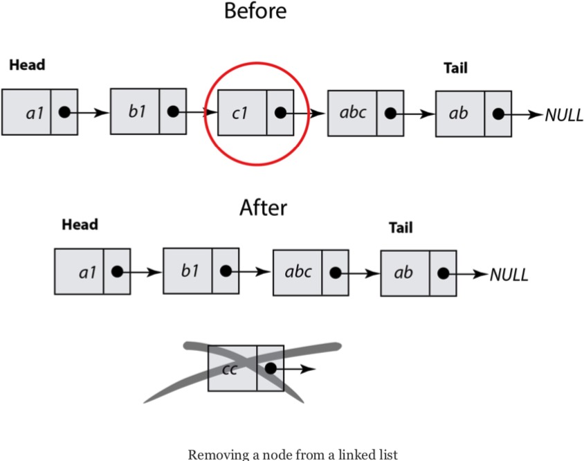

### Go 语言中的链表

**链表**是一种包含有限个元素的数据结构，其中每个元素至少占用两个存储单元，一个用于存储真正的数据，另一个用于存储链接当前元素和下一个元素的指针，从而建立了一个元素序列构成的链表。

链表中的第一个元素称为头，最后一个元素称为尾。在定义链表的过程中，你需要做的第一件事就是将链表头与其他变量区分开，因为链表头是你访问整个链表的唯一媒介。注意，如果弄丢了指向单向链表第一个节点的指针，你就没法再找到它了。

下图展示了一个拥有五个节点的链表：

下图描述了如何从链表中移除一个节点，它将帮助你更好地理解这个过程所涉及的步骤。你要做的主要是修改被删除节点左侧的那个节点，将其下一个元素设定为被删除节点右侧的那个节点。

下面的链表实现已经相对简化了，并且不含删除节点的功能，这个功能将留给读者作为练习题。