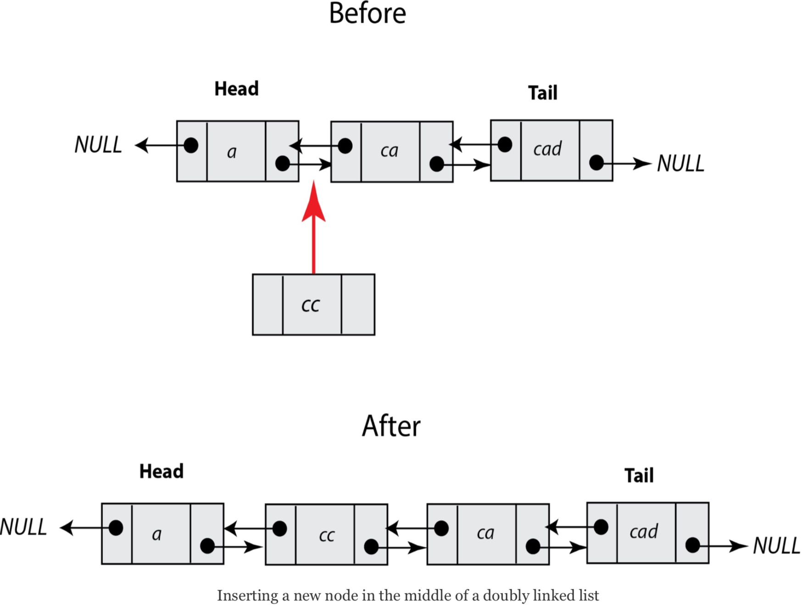

### Go 语言中的双向链表

**双向链表**中的每个节点都既有指向前一个元素的指针，又有指向下一个元素的指针。

双向链表形如下图：

因此，在一个双向链表中，第一个节点的后链接指向第二个节点，而它的前链接指向 `nil`（也称为 **NULL**）。类似的，最后一个节点的后链接指向 `nil`，而它的前链接指向双向链表中的倒数第二个节点。

本章的最后一个插图阐明了双向链表中增加节点的操作。可想而知，这个过程中的主要任务是处理新节点、新节点左侧节点、新节点右侧节点这三个节点的指针。

所以，单向链表和双向链表的主要区别实际上只是双向链表的操作会更冗杂。这是你为了能够从两个方向都能访问双向链表所必须付出的代价。